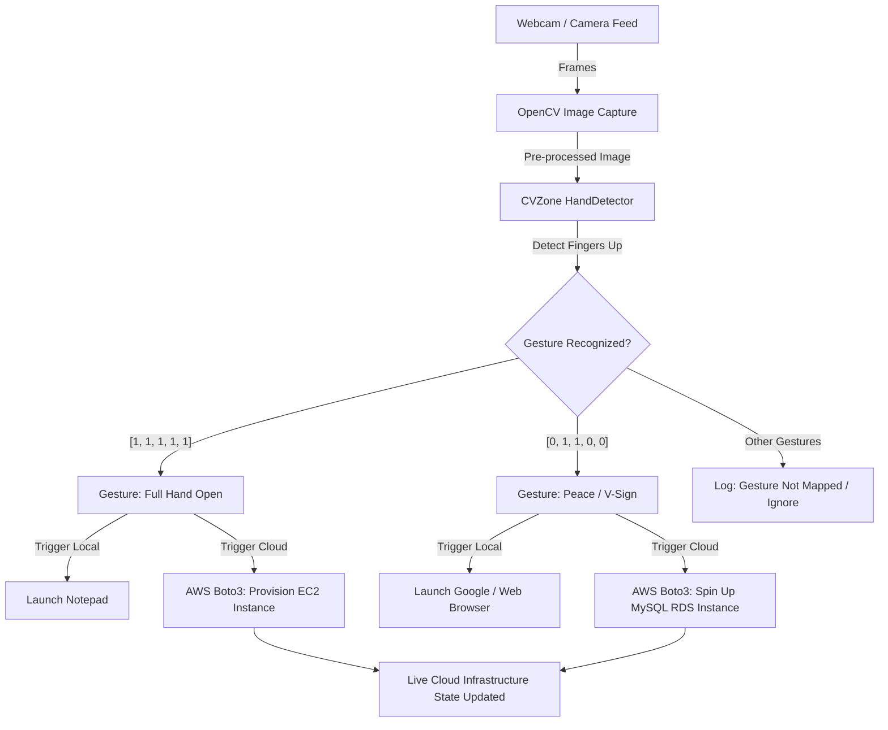

# ZeroTouchSec 🛡️👆

**Gesture-Driven AI Automation for Secure Cloud Operations & Surveillance Control**

---

[](LICENSE)
[](https://www.python.org/)
[](https://aws.amazon.com/)
[](https://opencv.org/)

ZeroTouchSec introduces a novel, touchless paradigm for cloud orchestration and surveillance control. By combining computer vision, real-time hand-tracking, and cloud APIs, it allows users to trigger critical workflows—such as launching EC2 instances or setting up database environments—using physical hand gestures alone. 

This stealthy, noise-immune system is optimized for high-security environments, cyber-defense operation centers, and clean-room settings where traditional physical inputs are impractical, slow, or insecure.

---

## 📖 Table of Contents
- [Key Features](#-key-features)
- [How It Works & System Flow](#-how-it-works--system-flow)
- [Gesture Mapping Matrix](#-gesture-mapping-matrix)
- [Tech Stack](#-tech-stack)
- [Getting Started](#-getting-started)
  - [Prerequisites](#prerequisites)
  - [Installation](#installation)
  - [AWS Configuration](#aws-configuration)
- [Usage Guide](#-usage-guide)
- [Why ZeroTouchSec? (Target Use Cases)](#-why-zerotouchsec-target-use-cases)
- [Future Roadmap](#-future-roadmap)
- [License](#-license)

---

## ✨ Key Features
- **Touchless Command Execution:** Deploy resources without keyboards, mice, or CLI commands.
- **Stealth & Silence:** Immune to ambient acoustic noise, eavesdropping, and voice-spoofing, making it ideal for tactical or covert environments.
- **Real-Time Hand Tracking:** Built on top of OpenCV and CVZone's robust machine learning pipeline for low-latency finger detection.
- **Direct Cloud Integration:** Leverages AWS Boto3 to instantly provision infrastructure (EC2, RDS) straight from the video stream.
- **Dual Control Plane:** Simultaneously maps gestures to local operating system processes (e.g., launch tools) and remote cloud infrastructure.
- **Interactive Jupyter Shell:** Easily customizable and ideal for testing, rapid prototyping, and deployment.

---

## 🛠️ How It Works & System Flow



---

## 📊 Gesture Mapping Matrix

The current implementation maps binary finger configurations to specific AWS and Local command sequences.

| Gesture | Finger State Vector | Local OS Action | AWS Cloud Automation Action |
| :--- | :---: | :--- | :--- |
| 🖐️ **Open Palm** | `[1, 1, 1, 1, 1]` | Opens Local Editor (`notepad`) | Provisions a Secure EC2 Instance (`t2.micro` / custom AMI) |
| ✌️ **Peace / V-Sign** | `[0, 1, 1, 0, 0]` | Launches Browser | Spins up a MySQL RDS Instance (`gesture-db`) |

---

## ⚙️ Tech Stack

- **Computer Vision:** `OpenCV-Python`, `CVZone` (MediaPipe-based hand tracking)
- **Cloud Orchestration:** `boto3` (AWS SDK for Python)
- **Development Environment:** Jupyter Notebooks (`ipykernel`)
- **System Integration:** Python `os` subsystem

---

## 🚀 Getting Started

Follow these steps to set up ZeroTouchSec locally.

### Prerequisites
- Python 3.8 or higher.
- A functional webcam/camera interface.
- An active AWS Account with permissions to provision EC2 and RDS resources.

### Installation

1. **Clone the repository:**
   ```bash
   git clone https://github.com/YOUR_USERNAME/ZeroTouchSec.git
   cd ZeroTouchSec
   ```

2. **Create and activate a virtual environment (optional but recommended):**
   ```bash
   python -m venv venv
   # On Windows:
   venv\Scripts\activate
   # On macOS/Linux:
   source venv/bin/activate
   ```

3. **Install the dependencies:**
   ```bash
   pip install opencv-python cvzone mediapipe boto3 notebook
   ```

### AWS Configuration

Configure your AWS credentials locally so that Boto3 can interact with your AWS account.

1. **Install the AWS CLI** (if you haven't already) and run:
   ```bash
   aws configure
   ```
2. **Provide your credentials when prompted:**
   - `AWS Access Key ID`
   - `AWS Secret Access Key`
   - `Default region name` (e.g., `us-east-1` or `ap-south-1`)
   - `Default output format` (e.g., `json`)

---

## 💻 Usage Guide

1. **Launch the Jupyter Notebook environment:**
   ```bash
   jupyter notebook
   ```
2. Open **`zerotouchsec.ipynb`** in the Jupyter environment.
3. Run the initialization cells to start your camera and set up the `HandDetector`.
4. Hold up your hand to the camera to trigger automation workflows:
   - **Show 🖐️ (All 5 fingers):** Deploys an EC2 instance.
   - **Show ✌️ (Index and middle finger only):** Launches an RDS Instance.
5. The notebook will automatically clean up camera resources upon completion.

---

## 🛡️ Why ZeroTouchSec? (Target Use Cases)

1. **Defense & Surveillance Installations:** Hands-free command and control of surveillance feeds, UAV drone arrays, and telemetry systems in harsh, physical environments.
2. **Cybersecurity Operations Centers (SOC):** Allows security officers to isolate compromised network subnets, shutdown database nodes, or spin up honey-pots under distress with discrete, silent movements.
3. **Surgical Rooms & Sterile Settings:** Healthcare workers can interact with patient database records and cloud records without violating touch-safety protocols.
4. **Industrial IoT & MSME Automation:** Minimal hardware configuration lowers the barrier to entry for smart gesture-control interfaces on factories and production floors.

---

## 🛣️ Future Roadmap

- [ ] **Advanced Semantic Gesture Mapping:** Expand finger gestures to recognize custom spatial movements (swipes, rotations, hold times).
- [ ] **Multi-Cloud Capabilities:** Support cross-cloud automated workflows on Microsoft Azure and Google Cloud Platform (GCP).
- [ ] **Biometric Access Gatekeeping:** Combine gesture-tracking with facial authentication to verify user permissions before triggering critical cloud infrastructure commands.
- [ ] **Offline Edge Fallbacks:** Allow fallback to local system scripts if the network connection to AWS is compromised.

---

## 📄 License
This project is licensed under the MIT License. See the [LICENSE](LICENSE) file for details.
