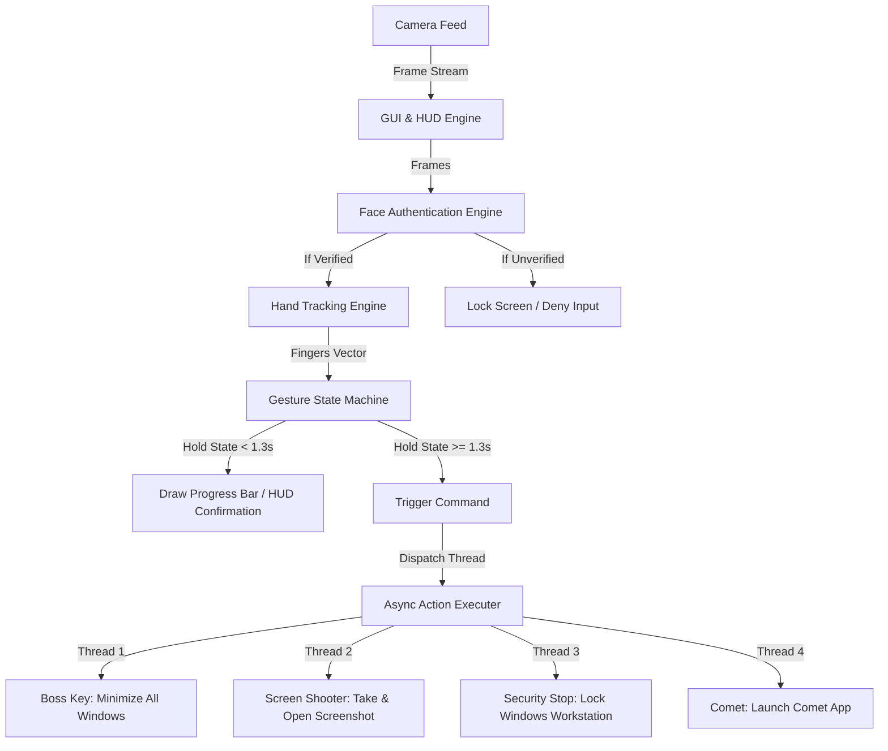

# ZeroTouchSec 🛡️👆

**Gesture-Driven AI Automation for Secure Workstation Control & Surveillance Interface**

---

[](LICENSE)
[](https://www.python.org/)
[](https://opencv.org/)
[](https://pyautogui.readthedocs.io/)

ZeroTouchSec introduces a novel, touchless paradigm for workstation control and interface management. By combining computer vision, real-time hand-tracking, and system simulation APIs, it allows users to trigger critical OS workflows using physical hand gestures alone.

Featuring a real-time Heads-Up Display (HUD), biometric authentication simulation, and safety-critical gesture confirmations, it turns any standard webcam into a futuristic, contactless command center.

---

## 📖 Table of Contents
- [Key Features](#-key-features)
- [How It Works & System Flow](#-how-it-works--system-flow)
- [Gesture Mapping Matrix](#-gesture-mapping-matrix)
- [Tech Stack](#-tech-stack)
- [Getting Started](#-getting-started)
  - [Prerequisites](#prerequisites)
  - [Installation](#installation)
- [Running the System](#-running-the-system)
- [Why ZeroTouchSec? (Target Use Cases)](#-why-zerotouchsec-target-use-cases)
- [License](#-license)

---

## ✨ Key Features
* 🚀 **Multithreaded Execution:** Non-blocking async threads dispatch system actions in the background, keeping the webcam capture frame rate running at a smooth, stable 30+ FPS.
* 🤖 **Futuristic Cyberpunk HUD:** Semi-transparent graphic panels, active telemetry trackers, live framerate logs, and a scrolling terminal console drawn directly onto the live feed using OpenCV.
* 🛡️ **Biometric Security Gatekeeping:** Simulates face verification with a scan overlay. The interface remains in a `LOCKED` state, rejecting gestures, until an operator is detected and authenticated.
* ⏳ **Safety-Critical Confirmation:** Prevents accidental action triggers. Users must hold a gesture for ~1.3 seconds while an interactive visual progress bar fills on screen to confirm command execution.

---

## 🛠️ How It Works & System Flow



---

## 📊 Gesture Mapping Matrix

The system maps hand configurations to specific Local OS command sequences.

| Gesture | Finger State Vector | Visual Representation | Local OS Automation Action |
| :--- | :---: | :---: | :--- |
| ✊ **Clenched Fist** | `[0, 0, 0, 0, 0]` | ✊ | **Boss Key / Panic Mode:** Minimizes all open windows instantly (`Win + D`) |
| 🔫 **Gun Gesture** | `[1, 1, 0, 0, 0]` | 🔫 | **Screen Shooter:** Takes a desktop screenshot and opens it in the image viewer |
| 🖐️ **Open Palm** | `[1, 1, 1, 1, 1]` | 🖐️ | **Security Stop:** Locks the Windows workstation instantly |
| ✌️ **Peace / V-Sign** | `[0, 1, 1, 0, 0]` | ✌️ | **Comet Launcher:** Launches the Comet application installed on the laptop |

---

## ⚙️ Tech Stack

* **Computer Vision:** `OpenCV-Python`, `CVZone` (MediaPipe-based hand tracking)
* **System Automation:** `PyAutoGUI` (Python keyboard/mouse simulation)
* **Development Environment:** Jupyter Notebooks (v1.0 Playground) & Python Script (v2.0 HUD App)
* **Multithreading:** Python `threading` subsystem

---

## 🚀 Getting Started

Follow these steps to set up ZeroTouchSec locally.

### Prerequisites
- Python 3.12 (highly recommended for MediaPipe stability).
- A functional webcam/camera interface.
- Windows OS (for keyboard simulation macros).

### Installation

1. **Clone the repository:**
   ```bash
   git clone https://github.com/YOUR_USERNAME/ZeroTouchSec.git
   cd ZeroTouchSec
   ```

2. **Activate your virtual environment (e.g., `venv`):**
   ```bash
   # On Windows PowerShell:
   .\venv\Scripts\activate
   ```

3. **Install the dependencies:**
   ```bash
   pip install opencv-python cvzone mediapipe pyautogui
   ```

---

## 💻 Running the System

Run the script to launch the full cyberpunk interface:
```bash
python app.py
```
* **Operator Lock:** System boots into `LOCKED` state. Show your hand 🖐️ to begin the scan and unlock the HUD.
* **Trigger Actions:** Hold either ✊, 🔫, 🖐️, or ✌️ for ~1.3 seconds to confirm.
* **Manual Lock:** Press `L` on the keyboard to manually lock the HUD console.
* **Exit:** Press `Q` to close the interface safely.

---

## 🛡️ Why ZeroTouchSec? (Target Use Cases)

1. **Cybersecurity Operations Centers (SOC):** Allows security officers to lock screens or hide sensitive data instantly under distress with a discrete fist gesture.
2. **Surgical Rooms & Sterile Settings:** Healthcare workers can interact with patient database records and web tools without violating touch-safety protocols.
3. **Clean-Room & Industrial IoT:** Hands-free command and control of dashboard displays in high-cleanliness or harsh physical environments.

---

## 📄 License
This project is licensed under the MIT License. See the [LICENSE](LICENSE) file for details.
