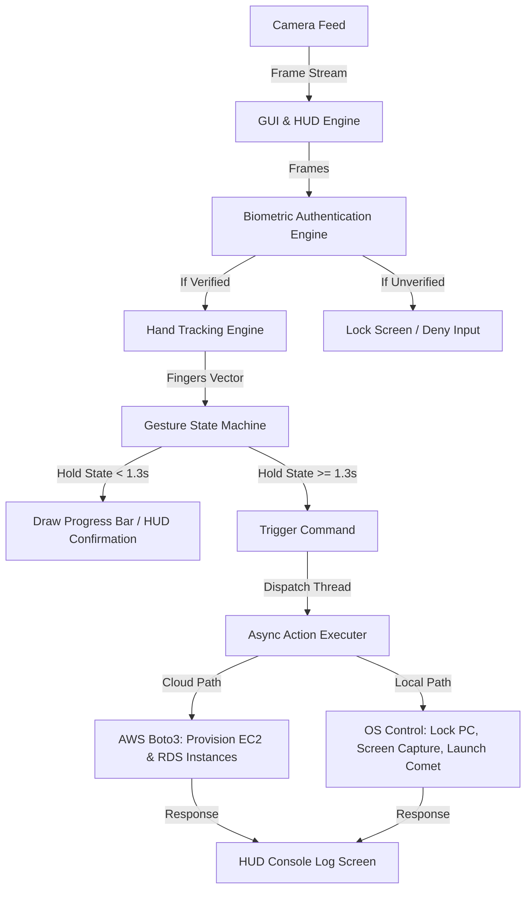

# ZeroTouchSec 🛡️👆

**Gesture-Driven AI Automation for Secure Cloud Operations & Surveillance Control**

---

[](LICENSE)
[](https://www.python.org/)
[](https://aws.amazon.com/)
[](https://opencv.org/)

ZeroTouchSec introduces a novel, touchless command-and-control paradigm for **Cloud Infrastructure Orchestration** and **Surveillance Feed Management**. 

Designed for high-security environments like **Cybersecurity Operations Centers (SOCs)**, **Defense & Surveillance command centers**, and **Surgical/Clean-room installations**, ZeroTouchSec enables real-time, touchless management of remote cloud environments (AWS EC2, RDS, security groups) and local physical console systems using computer vision and semantic hand gestures.

Unlike traditional voice or UI-based control, this approach is **silent, stealthy, and immune to ambient noise or voice spoofing**, making it ideal for covert or high-risk setups.

---

## 📖 Table of Contents
- [Core Architecture & Modes](#-core-architecture--modes)
  - [1. Cloud Operations Mode (AWS Boto3)](#1-cloud-operations-mode-aws-boto3)
  - [2. Secure Local Workstation Controller](#2-secure-local-workstation-controller)
- [Futuristic HUD & UI Features](#-futuristic-hud--ui-features)
- [Gesture Mapping Matrix](#-gesture-mapping-matrix)
- [How It Works & System Flow](#-how-it-works--system-flow)
- [Tech Stack](#-tech-stack)
- [Installation & Getting Started](#-installation--getting-started)
- [Target Application Areas](#-target-application-areas)
- [Roadmap](#-roadmap)

---

## 🏗️ Core Architecture & Modes

ZeroTouchSec operates on a **Dual-Plane Execution Model** to provide both local tactile response and remote cloud/edge automation:

### 1. Cloud Operations Mode (AWS Boto3)
*   **Automated Deployment:** Deploy secure EC2 compute instances or databases (MySQL RDS) in milliseconds with simple hand movements.
*   **Surveillance Orchestration:** Initiate remote drone feeds, activate security logging, or disconnect/isolate compromised subnets during a security breach.
*   **API-Driven Security:** Directly integrates with AWS SDK (`boto3`) to command cloud clusters natively.

### 2. Secure Local Workstation Controller (`app.py`)
*   **Offline Fallback Plane:** Controls the operator's local workstation when network connections to the cloud are restricted.
*   **Emergency Controls:** Instantly triggers panic keys (hiding work files), captures logs, launches primary monitoring tools (like the Comet interface), or locks the physical terminal.

---

## ✨ Futuristic HUD & UI Features
*   🚀 **Multithreaded Execution:** Non-blocking async threads dispatch heavy cloud API requests or system macros in the background, keeping the webcam feed running at a smooth, stable 30+ FPS.
*   🤖 **Cyberpunk Heads-Up Display (HUD):** Draws active telemetry stats, live frame rates (FPS), and hand tracker landmarks directly onto the live stream.
*   🛡️ **Biometric Scan Simulator:** The system defaults to a `LOCKED` state, ignoring gestures, until the operator presents an open palm to start a biometric signature scan and unlock the controls.
*   ⏳ **Confirmation Safeguards:** To prevent false positives (accidental triggers), commands require the operator to hold the gesture for 1.3 seconds while an interactive visual progress ring fills on the HUD.

---

## 📊 Gesture Mapping Matrix

The current implementation maps gestures to both local console fallbacks and remote cloud resources:

| Gesture | State Vector | Visual | Local OS Command | AWS / Cloud Security Action |
| :--- | :---: | :---: | :--- | :--- |
| **Clenched Fist** | `[0, 0, 0, 0, 0]` | ✊ | **Boss Key / Panic Mode:** Minimizes all open windows instantly (`Win + D`) | Isolates compromised subnets / halts active AWS pipelines |
| **Gun Gesture** | `[1, 1, 0, 0, 0]` | 🔫 | **Screen Shooter:** Captures and opens a desktop screenshot | Triggers visual surveillance snapshot logs |
| **Open Palm** | `[1, 1, 1, 1, 1]` | 🖐️ | **Security Stop:** Locks the workstation terminal | Initiates a full cloud infrastructure lockdown |
| **Peace Sign** | `[0, 1, 1, 0, 0]` | ✌️ | **Comet Launcher:** Launches the Comet control application | Provisions a MySQL RDS Database instance |

---

## 🛠️ How It Works & System Flow



---

## ⚙️ Tech Stack

*   **Computer Vision:** `OpenCV-Python`, `CVZone` (Google MediaPipe-based hand tracking)
*   **System Automation:** `PyAutoGUI` (for local hardware simulation)
*   **Cloud Orchestration:** `boto3` (AWS SDK for Python)
*   **Multithreading:** Python `threading` library for async command dispatch

---

## 🚀 Installation & Getting Started

### Prerequisites
- Python 3.12 (recommended for MediaPipe compatibility).
- A webcam or camera interface.
- Active AWS credentials (if using Cloud Operations Mode).

### Installation & Run
1.  **Clone the repository:**
    ```bash
    git clone https://github.com/YOUR_USERNAME/ZeroTouchSec.git
    cd ZeroTouchSec
    ```
2.  **Activate your virtual environment and install packages:**
    ```bash
    .\venv\Scripts\activate
    pip install opencv-python cvzone mediapipe pyautogui boto3
    ```
3.  **Run the HUD console:**
    ```bash
    python app.py
    ```

---

## 🛡️ Target Application Areas
1.  **Cybersecurity Operation Centers (SOC):** Rapid, touchless command boards for security specialists to initiate panic protocols or isolate environments.
2.  **Surgical Rooms & Sterile Spaces:** Touchless control of database queries, charts, and cloud resources without contamination.
3.  **Drone & CCTV Command Centers:** Hands-free camera grid switching and target locking.

---

## 📄 License
This project is licensed under the MIT License.
