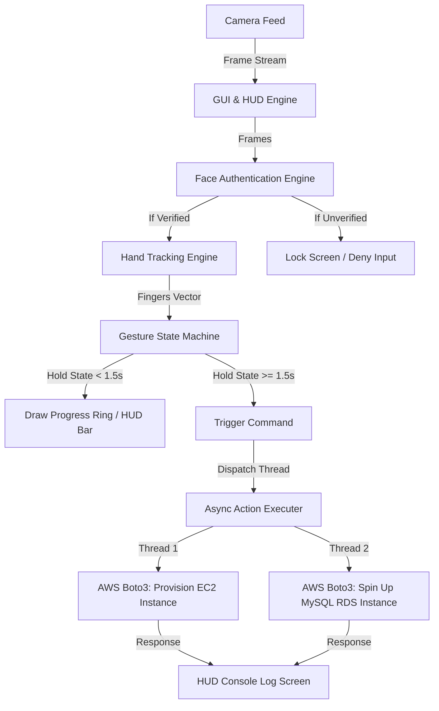

# ZeroTouchSec 🛡️👆

**Gesture-Driven AI Automation for Secure Cloud Operations & Surveillance Control**

---

[](LICENSE)
[](https://www.python.org/)
[](https://aws.amazon.com/)
[](https://opencv.org/)

ZeroTouchSec introduces a novel, touchless paradigm for cloud orchestration and surveillance control. By combining computer vision, real-time hand-tracking, and cloud APIs, it allows users to trigger critical workflows—such as launching EC2 instances or setting up database environments—using physical hand gestures alone.

With the **v2.0 HUD Upgrade**, the application transitions from a sequential Jupyter experiment into a fully threaded, secure cyber-physical command center featuring a real-time Heads-Up Display (HUD), biometric authentication, and safety-critical gesture confirmations.

---

## 📖 Table of Contents
- [Key Features](#-key-features)
- [How It Works & System Flow](#-how-it-works--system-flow)
- [Gesture Mapping Matrix](#-gesture-mapping-matrix)
- [Tech Stack](#-tech-stack)
- [Getting Started](#-getting-started)
  - [Prerequisites](#prerequisites)
  - [Installation](#installation)
  - [AWS Configuration](#aws-configuration)
- [Running the System](#-running-the-system)
- [Why ZeroTouchSec? (Target Use Cases)](#-why-zerotouchsec-target-use-cases)
- [Future Roadmap](#-future-roadmap)
- [License](#-license)

---

## ✨ Key Features (v2.0 Cyber-Physical HUD)
* 🚀 **Multithreaded Execution:** Non-blocking async threads dispatch AWS API requests in the background, keeping the webcam capture frame rate running at a smooth, stable 30+ FPS.
* 🤖 **Futuristic Cyberpunk HUD:** Semi-transparent graphic panels, active telemetry trackers, live framerate logs, and a scrolling terminal console drawn directly onto the live feed using OpenCV.
* 🛡️ **Biometric Security Gatekeeping:** Simulates face verification with a scan overlay. The interface remains in a `LOCKED` state, rejecting gestures, until an operator is detected and authenticated.
* ⏳ **Safety-Critical Confirmation:** Prevents accidental action triggers. Users must hold a gesture for 1.5 seconds while an interactive visual progress ring fills on screen to confirm command execution.

---

## 🛠️ How It Works & System Flow



---

## 📊 Gesture Mapping Matrix

The system maps hand configurations to specific AWS and Local command sequences.

| Gesture | Finger State Vector | Local OS Action | AWS Cloud Automation Action |
| :--- | :---: | :--- | :--- |
| 🖐️ **Open Palm** | `[1, 1, 1, 1, 1]` | Opens Local Editor (`notepad`) | Provisions a Secure EC2 Instance (`t2.micro` / custom AMI) |
| ✌️ **Peace / V-Sign** | `[0, 1, 1, 0, 0]` | Launches Browser | Spins up a MySQL RDS Instance (`gesture-db`) |

---

## ⚙️ Tech Stack

* **Computer Vision:** `OpenCV-Python`, `CVZone` (MediaPipe-based hand tracking)
* **Cloud Orchestration:** `boto3` (AWS SDK for Python)
* **Development Environment:** Jupyter Notebooks (v1.0 Playground) & Python Script (v2.0 HUD App)
* **Multithreading:** Python `threading` subsystem

---

## 🚀 Getting Started

Follow these steps to set up ZeroTouchSec locally.

### Prerequisites
- Python 3.8 or higher.
- A functional webcam/camera interface.
- An active AWS Account with permissions to provision EC2 and RDS resources.

### Installation

1. **Clone the repository:**
   ```bash
   git clone https://github.com/YOUR_USERNAME/ZeroTouchSec.git
   cd ZeroTouchSec
   ```

2. **Create and activate a virtual environment (optional but recommended):**
   ```bash
   python -m venv venv
   # On Windows:
   venv\Scripts\activate
   # On macOS/Linux:
   source venv/bin/activate
   ```

3. **Install the dependencies:**
   ```bash
   pip install opencv-python cvzone mediapipe boto3 notebook
   ```

### AWS Configuration

Configure your AWS credentials locally so that Boto3 can interact with your AWS account.

1. **Install the AWS CLI** (if you haven't already) and run:
   ```bash
   aws configure
   ```
2. **Provide your credentials when prompted:**
   - `AWS Access Key ID`
   - `AWS Secret Access Key`
   - `Default region name` (e.g., `us-east-1` or `ap-south-1`)
   - `Default output format` (e.g., `json`)

---

## 💻 Running the System

You can run ZeroTouchSec in two ways:

### 1. v2.0 Production HUD Application (Recommended)
Run the script to launch the full cyberpunk interface:
```bash
python app.py
```
- **Operator Lock:** System boots into `LOCKED` state. Show your hand 🖐️ to begin the scan and unlock the HUD.
- **Trigger Actions:** Hold either 🖐️ (EC2) or ✌️ (RDS) for 1.5 seconds to confirm.
- **Manual Lock:** Press `L` on the keyboard to manually lock the HUD console.
- **Exit:** Press `Q` to close the interface safely.

### 2. Jupyter Notebook Playground (v1.0)
```bash
jupyter notebook
```
Open **`zerotouchsec.ipynb`** to test individual blocks, customize API calls, or run basic tests sequentially.

---

## 🛡️ Why ZeroTouchSec? (Target Use Cases)

1. **Defense & Surveillance Installations:** Hands-free command and control of surveillance feeds, UAV drone arrays, and telemetry systems in harsh, physical environments.
2. **Cybersecurity Operations Centers (SOC):** Allows security officers to isolate compromised network subnets, shutdown database nodes, or spin up honey-pots under distress with discrete, silent movements.
3. **Surgical Rooms & Sterile Settings:** Healthcare workers can interact with patient database records and cloud records without violating touch-safety protocols.
4. **Industrial IoT & MSME Automation:** Minimal hardware configuration lowers the barrier to entry for smart gesture-control interfaces on factories and production floors.

---

## 🛣️ Future Roadmap

- [ ] **Advanced Semantic Gesture Mapping:** Expand finger gestures to recognize custom spatial movements (swipes, rotations, hold times).
- [ ] **Multi-Cloud Capabilities:** Support cross-cloud automated workflows on Microsoft Azure and Google Cloud Platform (GCP).
- [ ] **Biometric Access Gatekeeping:** Combine gesture-tracking with facial authentication to verify user permissions before triggering critical cloud infrastructure commands.
- [ ] **Offline Edge Fallbacks:** Allow fallback to local system scripts if the network connection to AWS is compromised.

---

## 📄 License
This project is licensed under the MIT License. See the [LICENSE](LICENSE) file for details.
